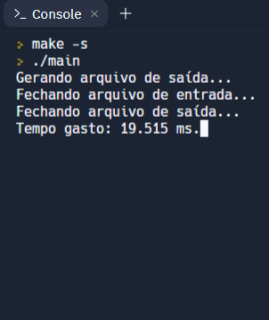
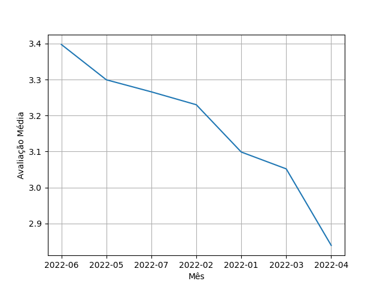

<h1 align="center">Bubble Sort - Spotify</h1>

Aplicação do algoritmo Bubble Sort para busca e ordenação em análise de avaliações do aplicativo Spotify.

 

## Complexidade do Algoritmo de Ordenação escolhido

O Algoritmo de ordenação Bubble Sort tem complexidade computacional é igual a O(N^2), ou seja, de ordem quadrática. Porém, no melhor caso, pode ser um algoritmo de complexidade computacional igual a O(N).

 

## Tempo de Processamento para o Cálculo das Avaliações Médias

O tempo de processamento médio encontrado no cálculo das avaliações médias foi de 20.451ms, rodando o código no Replit.com.

</img>

 

## Gráfico com análise das avaliações médias por mês

</img>